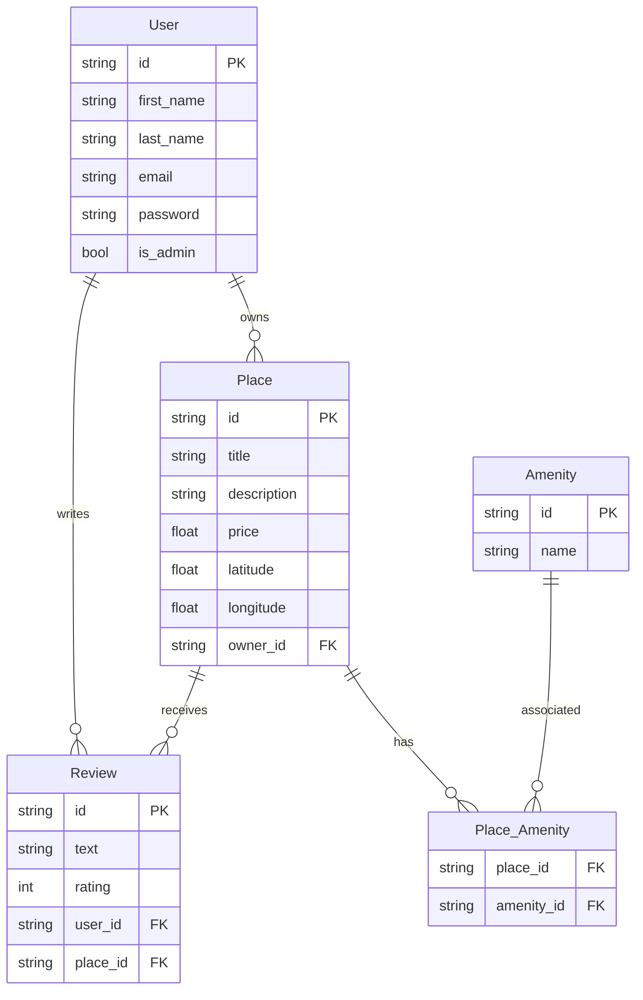

# HBnB Part 3 - REST API with Authentication and Authorization

## Overview

This Part 3 of the HBnB project implements a complete REST API for a lodging rental application (Airbnb-like). The API manages users, places, reviews, and amenities, with a JWT authentication system and role-based authorization (user/admin).

## Prerequisites

- Python 3.8+
- pip

### Dependencies

Dependencies are listed in `requirements.txt`:

```
flask
flask-restx
flask-bcrypt
flask-jwt-extended
sqlalchemy
flask-sqlalchemy
```

Install them with:
```bash
pip install -r requirements.txt
```

## Configuration

The application uses a default configuration for development with SQLite. The `config.py` file defines:

- `SECRET_KEY`: Secret key for JWT (default or environment variable)
- `DEBUG`: Debug mode enabled in development
- `SQLALCHEMY_DATABASE_URI`: SQLite database URI (`development.db`)

## Architecture

### Project Structure

```
part3/
├── app/
│   ├── __init__.py          # Flask application factory
│   ├── api/
│   │   └── v1/
│   │       ├── __init__.py
│   │       ├── auth.py      # Authentication endpoints
│   │       ├── users.py     # User endpoints
│   │       ├── places.py    # Place endpoints
│   │       ├── reviews.py   # Review endpoints
│   │       └── amenities.py # Amenity endpoints
│   ├── models/
│   │   ├── base.py          # Base model with UUID and timestamps
│   │   ├── user.py          # User model
│   │   ├── place.py         # Place model
│   │   ├── review.py        # Review model
│   │   └── amenity.py       # Amenity model
│   ├── persistence/
│   │   ├── repository.py    # Generic SQLAlchemy repository
│   │   ├── user_repository.py # Specialized User repository
│   │   └── __init__.py
│   └── services/
│       ├── facade.py        # Service layer (business logic)
│       └── __init__.py
├── config.py                # Configuration
├── requirements.txt         # Dependencies
├── run.py                   # Entry point
└── tests/
    └── tests_class.py       # Unit tests
```

### Technologies Used

- **Flask**: Web framework
- **Flask-RESTX**: Extension for REST APIs with Swagger documentation
- **SQLAlchemy**: ORM for database
- **Flask-JWT-Extended**: JWT authentication
- **Flask-Bcrypt**: Password hashing

## Database

### Schema

The application uses a relational database with the following tables:

#### Users
- `id` (String, UUID, PK)
- `first_name` (String)
- `last_name` (String)
- `email` (String, unique)
- `password` (String, hashed)
- `is_admin` (Boolean)
- `created_at` (DateTime)
- `updated_at` (DateTime)

#### Places
- `id` (String, UUID, PK)
- `title` (String)
- `description` (String)
- `price` (Float)
- `latitude` (Float)
- `longitude` (Float)
- `owner_id` (String, FK → Users.id)
- `created_at` (DateTime)
- `updated_at` (DateTime)

#### Reviews
- `id` (String, UUID, PK)
- `text` (String)
- `rating` (Integer, 1-5)
- `owner_id` (String, FK → Users.id)
- `place_id` (String, FK → Places.id)
- `created_at` (DateTime)
- `updated_at` (DateTime)
- Unique constraint: `(owner_id, place_id)` (one review per user per place)

#### Amenities
- `id` (String, UUID, PK)
- `name` (String, unique)
- `created_at` (DateTime)
- `updated_at` (DateTime)

#### Place_Amenity (many-to-many junction table)
- `place_id` (String, FK → Places.id, PK)
- `amenity_id` (String, FK → Amenities.id, PK)

### Relationships

- **User → Place**: One-to-many (a user can own multiple places)
- **User → Review**: One-to-many (a user can write multiple reviews)
- **Place → Review**: One-to-many (a place can have multiple reviews)
- **Place ↔ Amenity**: Many-to-many via Place_Amenity (a place can have multiple amenities, an amenity can be associated with multiple places)

### ER Diagram



## Installation and Execution

1. Clone the repository and navigate to `part3/`
2. Install dependencies:
   ```bash
   pip install -r requirements.txt
   ```
3. Run the application:
   ```bash
   python run.py
   ```
4. The API will be accessible at `http://localhost:5000/api/v1/`
5. Swagger documentation: `http://localhost:5000/api/v1/`

## Authentication

The API uses JWT (JSON Web Tokens) for authentication.

### Login

**Endpoint**: `POST /api/v1/auth/login`

**Body**:
```json
{
  "email": "user@example.com",
  "password": "password"
}
```

**Response**:
```json
{
  "access_token": "eyJ0eXAiOiJKV1QiLCJhbGciOiJIUzI1NiJ9..."
}
```

Use the token in the `Authorization: Bearer <token>` header for protected endpoints.

## Capabilities by Role

### Standard User

#### Users
- Create an account (`POST /users`)
- View all users (`GET /users`)
- View user details (`GET /users/<id>`)
- Update own profile (name only) (`PUT /users/<id>`)

#### Places
- List all places (`GET /places`)
- View place details (`GET /places/<id>`)
- Create a place (`POST /places`) - becomes owner
- Update own places (`PUT /places/<id>`)
- View place reviews (`GET /places/<id>/reviews`)

#### Reviews
- List all reviews (`GET /reviews`)
- View review details (`GET /reviews/<id>`)
- Create a review on a place (not own place, one per place) (`POST /reviews`)
- Update own reviews (`PUT /reviews/<id>`)
- Delete own reviews (`DELETE /reviews/<id>`)

#### Amenities
- List all amenities (`GET /amenities`)
- View amenity details (`GET /amenities/<id>`)

### Administrator

In addition to user rights:

#### Users
- Create an account (`POST /users`)
- Update any user (email, password, role) (`PUT /users/<id>`)

#### Places
- Update any place (`PUT /places/<id>`)

#### Reviews
- Update any review (`PUT /reviews/<id>`)
- Delete any review (`DELETE /reviews/<id>`)

#### Amenities
- Create an amenity (`POST /amenities`)
- Update an amenity (`PUT /amenities/<id>`)

## API Endpoints

### Authentication
- `POST /auth/login` - Login
- `GET /auth/protected` - Protected endpoint (test)

### Users
- `POST /users` - Create user
- `GET /users` - List users
- `GET /users/<id>` - User details
- `PUT /users/<id>` - Update user

### Places
- `POST /places` - Create place (auth required)
- `GET /places` - List places
- `GET /places/<id>` - Place details
- `PUT /places/<id>` - Update place (auth required)
- `GET /places/<id>/reviews` - Place reviews

### Reviews
- `POST /reviews` - Create review (auth required)
- `GET /reviews` - List reviews
- `GET /reviews/<id>` - Review details
- `PUT /reviews/<id>` - Update review (auth required)
- `DELETE /reviews/<id>` - Delete review (auth required)

### Amenities
- `POST /amenities` - Create amenity (admin)
- `GET /amenities` - List amenities
- `GET /amenities/<id>` - Amenity details
- `PUT /amenities/<id>` - Update amenity (admin)

## Validation and Security

### Data Validation
- Models with server-side validation (types, lengths, ranges)
- API validation with Flask-RESTX
- Error handling with descriptive messages

### Security
- Passwords hashed with Bcrypt
- JWT authentication
- Role-based authorization (admin/user)
- Implicit CSRF protection via JWT
- Input validation to prevent injections

## Testing

Run tests with:
```bash
python -m unittest tests/tests_class.py
```

Tests cover:
- Models and validation
- Repositories
- Services (facade)
- Database integration

## API Usage Examples

### User Registration
```bash
curl -X POST http://localhost:5000/api/v1/users \
  -H "Content-Type: application/json" \
  -d '{
    "first_name": "John",
    "last_name": "Doe",
    "email": "john@example.com",
    "password": "securepassword"
  }'
```

### Login
```bash
curl -X POST http://localhost:5000/api/v1/auth/login \
  -H "Content-Type: application/json" \
  -d '{
    "email": "john@example.com",
    "password": "securepassword"
  }'
```

### Create Place (with JWT token)
```bash
curl -X POST http://localhost:5000/api/v1/places \
  -H "Content-Type: application/json" \
  -H "Authorization: Bearer YOUR_JWT_TOKEN" \
  -d '{
    "title": "Beautiful Apartment",
    "description": "A nice place to stay",
    "price": 100.0,
    "latitude": 40.7128,
    "longitude": -74.0060,
    "amenities": ["wifi", "parking"]
  }'
```

### Create Review
```bash
curl -X POST http://localhost:5000/api/v1/reviews \
  -H "Content-Type: application/json" \
  -H "Authorization: Bearer YOUR_JWT_TOKEN" \
  -d '{
    "text": "Great place!",
    "rating": 5,
    "place_id": "place-uuid"
  }'
```

## Error Handling

The API returns appropriate HTTP status codes and JSON error messages:

- `200`: Success
- `201`: Created
- `400`: Bad Request (validation errors)
- `401`: Unauthorized (missing/invalid JWT)
- `403`: Forbidden (insufficient permissions)
- `404`: Not Found

Example error response:
```json
{
  "error": "Invalid input data"
}
```

## Deployment

For production deployment:

1. Set environment variables:
   ```bash
   export SECRET_KEY="your-secret-key"
   export FLASK_ENV="production"
   ```

2. Use a production WSGI server like Gunicorn:
   ```bash
   pip install gunicorn
   gunicorn -w 4 -b 0.0.0.0:8000 run:app
   ```

3. Configure a production database (PostgreSQL, MySQL) in `config.py`

## Contributing

1. Fork the repository
2. Create a feature branch
3. Make your changes
4. Add tests for new functionality
5. Ensure all tests pass
6. Submit a pull request

## General Workflow

1. **Registration/Login**: Users register via `POST /users`, login via `POST /auth/login` to get a JWT.

2. **Place Management**: Owners create and manage their places. Amenities are associated via many-to-many relationship.

3. **Reviews**: Users can leave one review per place (rating 1-5 + text), with integrity constraints.

4. **Administration**: Admins can manage all content and users.

5. **REST API**: All endpoints follow REST principles, with appropriate HTTP codes and JSON responses.

The application is designed to be extensible, with clear separation between API, services, and persistence layers.

## Authors

- **Morgane** - Holberton Student - [GitHub Profile](https://github.com/your-github-Alreix)
- **Joan** - Holberton Student - [GitHub Profile](https://github.com/frxjoan)
- **Bengin** - Holberton Student - []